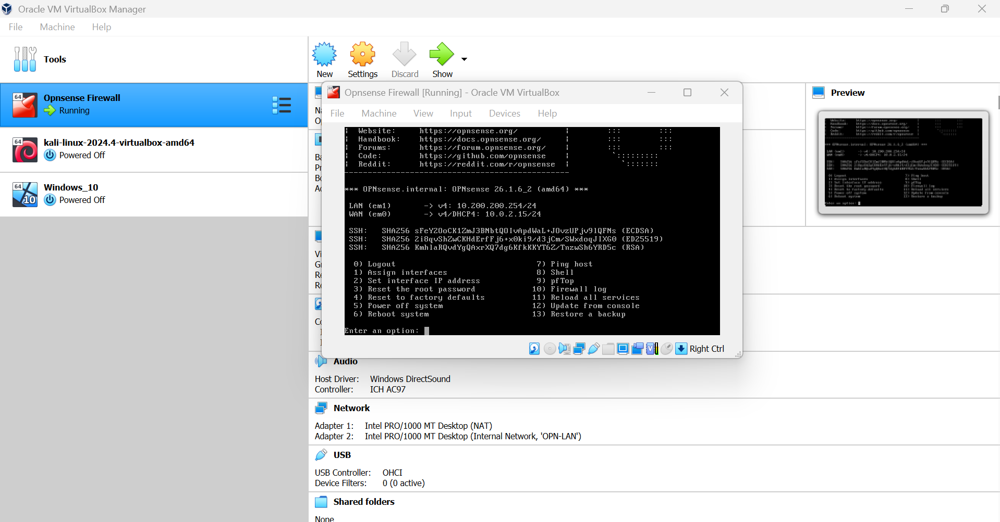
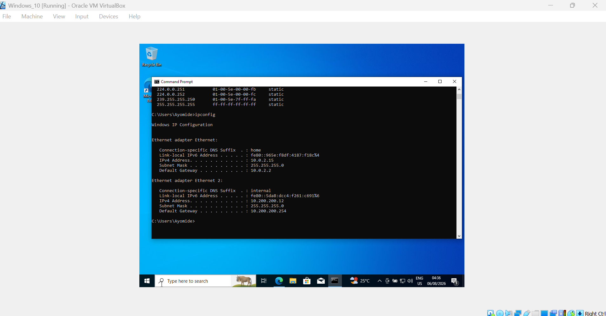
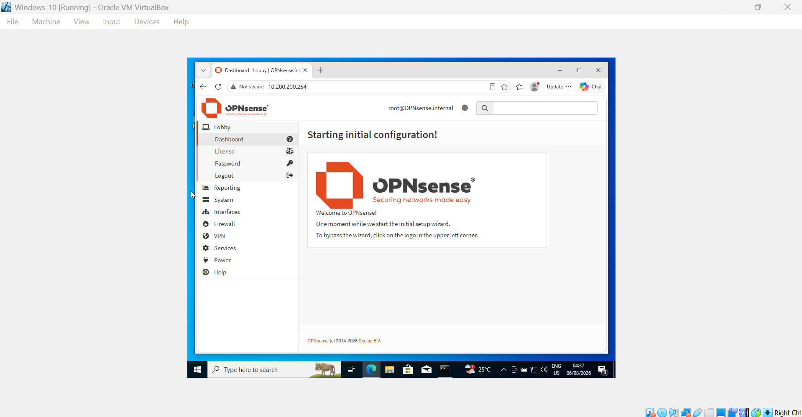
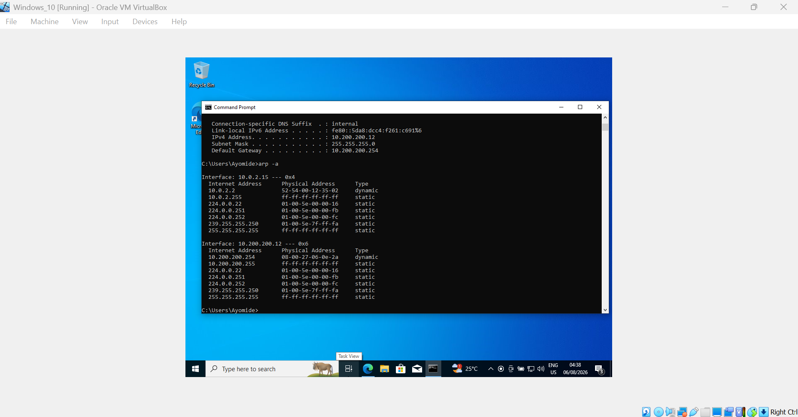

# opnsense-network-security-lab
Hands-on virtual network security lab using OPNsense, VirtualBox, Kali Linux, and Windows.
# OPNsense Network Security Lab

## Overview

This project documents my hands-on practice building and troubleshooting a virtual network security environment using OPNsense and virtual machines.

The lab was created to strengthen my understanding of network security, firewall configuration, IP addressing, virtual networking, and connectivity troubleshooting.

## Lab Environment

- OPNsense
- VirtualBox
- Kali Linux
- Windows
- Virtual network interfaces
- IPv4 networking

## Objectives

- Build a virtual network security environment
- Configure a LAN interface on OPNsense
- Practice IPv4 addressing and network configuration
- Connect virtual machines to the network
- Test connectivity between network devices
- Troubleshoot network communication problems
- Develop practical understanding of firewall and network security concepts

## Network Configuration

The lab included an OPNsense LAN network using the `10.200.200.0/24` address range.

The OPNsense LAN interface was configured as:

`10.200.200.254/24`

A virtual machine was also configured within the same network for connectivity testing.

## Practical Work

### OPNsense Configuration

Configured and explored OPNsense as the central network security device within the virtual environment.

### Virtual Machine Networking

Worked with Kali Linux and Windows virtual machines connected through VirtualBox networking.

### Connectivity Testing

Performed connectivity tests between the virtual machines and OPNsense while troubleshooting network communication issues.

### Troubleshooting

Investigated issues involving virtual network interfaces, IP addressing, and communication between the virtual machines and OPNsense.

## Skills Demonstrated

- OPNsense
- VirtualBox networking
- Firewall concepts
- IPv4 addressing
- LAN configuration
- Virtual machine networking
- Network troubleshooting
- Basic network security

## What I Learned

This lab gave me practical experience connecting networking concepts with a virtual security environment.

It strengthened my understanding of how firewalls, virtual machines, network interfaces, IP addressing, and connectivity work together in a network security environment.

## Career Direction

This project supports my long-term goal of developing deeper expertise in network engineering and cybersecurity through practical experience and advanced study.

## Practical Evidence

### OPNsense Interface Configuration

The OPNsense firewall was configured with a WAN interface using DHCP and a static LAN interface on the `10.200.200.0/24` network.

### Windows Network Configuration

The Windows virtual machine was configured on the OPNsense LAN network with an IPv4 address of `10.200.200.12/24` and OPNsense as its gateway.

### OPNsense Web Interface

The Windows virtual machine was able to access the OPNsense WebGUI through the LAN address, confirming network-level connectivity between the systems.

### ARP Connectivity Test

The ARP table showed a dynamic MAC address entry for the OPNsense LAN interface, providing evidence that Windows was successfully discovering the OPNsense device on the local network.

## Troubleshooting

During testing, ICMP ping from Windows to the OPNsense LAN address did not receive a response.

The investigation confirmed:

- Correct IPv4 addressing
- Correct `/24` subnet configuration
- Correct default gateway
- Successful ARP resolution
- Successful access to the OPNsense WebGUI

This provided practical experience troubleshooting network connectivity at different layers rather than assuming that a failed ping meant the entire network connection was unavailable.
